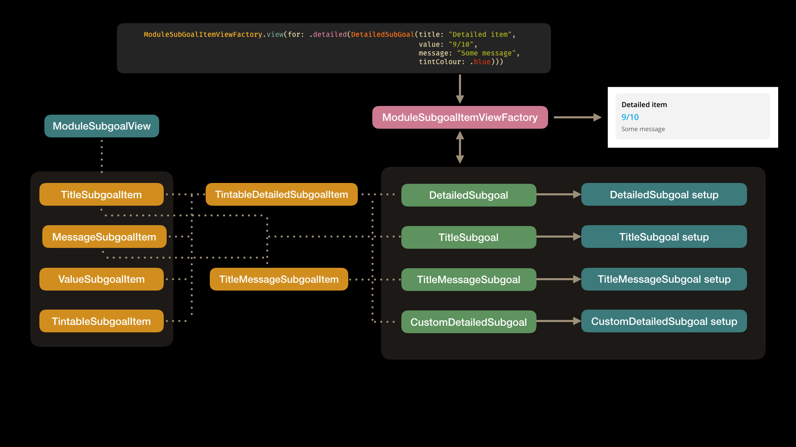

# Open-closed / Dependency Inversion / Single Responsibility / Interface Segregation Example
The `ModuleGoalWithSubGoalListTableViewCell` was built with two purposes in mind, being a goal cell header of some sorts and then catering for a subgoal list.
you would typically pass in a response and it would figure out what type of subgoal list to show etc. 
It would use `GoalListCardViewController` to house the subgoal list and then `GoalListContentView` would be the individual list items. 
A few problems encountered here was:
1. `GoalListContentView` was trying to do too much, having to manage way to many components where we don't even use all of them ever together.(breaking single responsiability)
2. One was forced to deal with all the component properties of the list content view, even if we don't need them. An interface is forcing us to implement all of the components in the view. (Breaking the Interface Segregation Principle)
3. When a new sub goal item type was added another check had to be added to the `GoalListContentView` to hide or show labels or buttons depending on the use case. (Breaking the open closed principle because you had to go and modify the `GoalListContentView` class instead of extending it)
4. There is no abstration (Breaking dependency inversion)

### Before code snippets:
`ModuleGoalWithSubGoalListTableViewCell.swift`
```swift
public class ModuleGoalWithSubGoalListTableViewCell: UITableViewCell {
    private var viewModel: ModuleGoalWithSubgoalListViewModelType?
    private var goalListViewController: GoalListCardViewController?

    @IBOutlet weak var containerView: UIView!
    @IBOutlet weak var listPlaceholderView: UIView!
    @IBOutlet weak var goalTitle: UILabel!
    @IBOutlet weak var goalSubtitle: UILabel!
    @IBOutlet weak var goalActionButton: MEMSecondaryButton!
    @IBOutlet weak var goalImageView: UIImageView!
    @IBOutlet weak var goalRewardLabel: UILabel!

    internal var actionHandler: ActionButtonHandler?

    public override func awakeFromNib() {
        super.awakeFromNib()
        configureStyle()
    }

    private func configureStyle() {
        selectionStyle = .none
        goalTitle.configure(with: MEMAppearanceHandler.shared().blackTextColor(),
                            font: MEMAppearanceHandler.shared().semiBoldFont(withSize: 17))
        goalSubtitle.configure(with: MEMAppearanceHandler.shared().charcoalGrayTextColor(),
                               font: MEMAppearanceHandler.shared().regularFont(withSize: 15))
        goalRewardLabel.configure(with: MEMAppearanceHandler.shared().whiteTextColor(),
                                  font: MEMAppearanceHandler.shared().boldFont(withSize: 20))
        goalActionButton.buttonColor = MEMAppearanceHandler.shared().discoveryVitalityTintColor()
    }

    public func setUpCell(with viewModel: ModuleGoalWithSubgoalListViewModelType, actionButtonHandler: ActionButtonHandler?) {
        self.viewModel = viewModel
        self.actionHandler = actionButtonHandler
        setUpImage() 
        setUpLabels()
        setUpSubGoals()
    }

    private func setUpImage() {
        if let image = UIImage(named: "coinGoldBackground", in: MembersActiveRewards.bundle, compatibleWith: nil) {
            goalImageView.image = image
        } else {
            goalImageView.isHidden = false
        }
    }

    private func setUpLabels() {
        goalTitle.text = viewModel?.title ?? ""
        goalRewardLabel.text = viewModel?.rewardAmount ?? ""

        if let subtitleText = viewModel?.subtitle {
            goalSubtitle.text = subtitleText
        } else {
            goalSubtitle.isHidden = true
        }

        if let actionTitleText = viewModel?.actionTitle {
            goalActionButton.setTitle(actionTitleText, for: .normal)
        } else {
            goalActionButton.isHidden = true
        }
    }

    fileprivate func setUpSubGoals() {
        if let subGoals = viewModel?.subGoals {
            containerView.isHidden = false
            addGoalList(for: subGoals)
        } else {
            containerView.isHidden = true
        }
    }

    private func addGoalList(for subGoals: [GoalListItem] ) {
        let viewController = GoalListCardViewController.viewController(with: subGoals)
        viewController.view.translatesAutoresizingMaskIntoConstraints = false
        listPlaceholderView.addSubview(viewController.view)
        viewController.view.constrainEdges(to: listPlaceholderView)
        goalListViewController = viewController
    }

    @IBAction func buttonTapped(_ sender: Any) {
        actionHandler?()
    }
}
```

`GoalListCardViewController.swift`
```swift
public class GoalListCardViewController: UIViewController, Nibloadable {
    @IBOutlet weak var containerStackView: UIStackView!
    private var listItems: [GoalListItem] = []

    public static func viewController(with items: [GoalListItem]) -> GoalListCardViewController {
        guard let viewController = GoalListCardViewController.loadFromNib() else { return GoalListCardViewController() }
        viewController.listItems = items
        return viewController
    }

    override public func viewDidLoad() {
        super.viewDidLoad()
        view.backgroundColor = MEMAppearanceHandler.shared().whiteSmokeColor()
        view.layer.cornerRadius = 10
        addItems()
    }

    public func addItems() {
        for (index, item) in listItems.enumerated() {
            containerStackView.addArrangedSubview(contentView(with: item))
            if index < listItems.count - 1 {
                containerStackView.addArrangedSubview(UIView.seperatorView())
            }
        }
    }

    private func contentView(with item: GoalListItem) -> UIView {
        guard let view = GoalListContentView.viewFromNib() else { return UIView() }
        view.setUp(item: item)
        return view
    }
}
```

`GoalListContentView.swift`
```swift
public struct GoalListItem {
    var title: String
    var value: String
    var detail: String?
    var style: GoalListCardStyles
    var icon: UIImage?
    var tintColor: UIColor?
    var actionButtonText: String?

    public init(title: String,
                value: String? = nil,
                detail: String? = nil,
                icon: UIImage? = nil,
                tintColor: UIColor? = nil,
                actionButtonText: String? = nil) {
        if value == nil && detail == nil && actionButtonText == nil {
            self.style = .simple
        } else if actionButtonText != nil {
            self.style = .actionable
        } else {
            self.style = .detailed
        }

        self.title = title
        self.value = value ?? "-"
        self.detail = detail
        self.icon = icon
        self.tintColor = tintColor
        self.actionButtonText = actionButtonText
    }
}

internal enum GoalListCardStyles {
    case detailed
    case simple
    case actionable
}

internal class GoalListContentView: UIView {
    @IBOutlet weak var titleLabelContainerView: UIView!
    @IBOutlet weak var titleLabel: UILabel!
    @IBOutlet weak var titleImageView: UIImageView!
    @IBOutlet weak var valueLabel: UILabel!
    @IBOutlet weak var detailLabel: UILabel!
    @IBOutlet weak var actionButton: UIButton!

    @IBOutlet weak var stackViewTopConstraint: NSLayoutConstraint!
    @IBOutlet weak var stackViewBottomConstraint: NSLayoutConstraint!
    
    let kHeightOfTopAndBottomPadding: CGFloat = 15.0
    let kHeightOfTopAndBottomPaddingForSimple: CGFloat = 10.0

    override internal func awakeFromNib() {
        super.awakeFromNib()
        backgroundColor = MEMAppearanceHandler.shared().clearColor()
        titleLabelContainerView.backgroundColor = MEMAppearanceHandler.shared().clearColor()
    }

    internal func setUp(item: GoalListItem) {
        titleLabel.text = item.title
        valueLabel.text = item.value

        if item.detail == nil {
            detailLabel.isHidden = true
        } else {
            detailLabel.text = item.detail
        }


        if let itemIcon = item.icon {
            titleImageView.image = itemIcon
            titleImageView.image = titleImageView.image?.withRenderingMode(.alwaysTemplate)
            titleImageView.tintColor = MEMAppearanceHandler.shared().successGreenColor()
        } else  {
            titleImageView.isHidden = true
        }

        if let itemButtonTitle = item.actionButtonText {
            actionButton.setTitle(itemButtonTitle, for: .normal)
            actionButton.tintColor = MEMAppearanceHandler.shared().discoveryVitalityTintColor()
        }

        switch item.style {
        case .detailed:
            styleForDetailed(tintColour: item.tintColor ?? MEMAppearanceHandler.shared().blackTextColor())
        case .simple:
            styleForSimple()
        case .actionable:
            styleForActionable()
        }
    }

    private func styleForDetailed(tintColour: UIColor) {
        actionButton.isHidden = true
        titleLabel.configure(with: MEMAppearanceHandler.shared().blackTextColor(),
                             font: MEMAppearanceHandler.shared().semiBoldFont(withSize: 17),
                             numberOfLines: 0)
        valueLabel.configure(with: tintColour,
                             font: MEMAppearanceHandler.shared().semiBoldFont(withSize: 20),
                             numberOfLines: 0)
        detailLabel.configure(with: MEMAppearanceHandler.shared().charcoalGrayTextColor(),
                              font: MEMAppearanceHandler.shared().regularFont(withSize: 15),
                              numberOfLines: 0)
        updateStackViewConstraints(with: kHeightOfTopAndBottomPadding)
    }

    private func styleForSimple() {
        actionButton.isHidden = true
        titleLabel.configure(with: MEMAppearanceHandler.shared().blackTextColor(),
                             font: MEMAppearanceHandler.shared().regularFont(withSize: 17),
                             numberOfLines: 0)
        valueLabel.isHidden = true
        detailLabel.isHidden = true
        updateStackViewConstraints(with: kHeightOfTopAndBottomPaddingForSimple)
    }

    private func styleForActionable() {
        actionButton.isHidden = false
        valueLabel.isHidden = true

        titleLabel.configure(with: MEMAppearanceHandler.shared().blackTextColor(),
                             font: MEMAppearanceHandler.shared().semiBoldFont(withSize: 17),
                             numberOfLines: 0)
        detailLabel.configure(with: MEMAppearanceHandler.shared().charcoalGrayTextColor(),
                              font: MEMAppearanceHandler.shared().regularFont(withSize: 15),
                              numberOfLines: 0)
        actionButton.titleLabel?.font = MEMAppearanceHandler.shared().regularFont(withSize: 17)
        updateStackViewConstraints(with: kHeightOfTopAndBottomPadding)
    }

    private func updateStackViewConstraints(with constant: CGFloat) {
        stackViewTopConstraint.constant = constant
        stackViewBottomConstraint.constant = constant
    }
}
```

### After
#### Single responsibility 
Starting with the Subgoal list we create a new view that only deals with subgoal items that has a title, value and message with the option to tint any label. Any use cases outside of this one, we will create a new view. 
For now we don’t include a method to setup the view as a whole, but rather setup individual labels. We also hide all labels by default and only show them if we need to, i.e. a text for that label is available. 

```swift
class ModuleSubgoalItemView: UIView {
    // By default all outlets are set to hidden, have to be explicitly unhide them
    @IBOutlet weak var titleLabel: UILabel!
    @IBOutlet weak var valueLabel: UILabel!
    @IBOutlet weak var messageLabel: UILabel!

    override internal func awakeFromNib() {
        super.awakeFromNib()
        backgroundColor = MEMAppearanceHandler.shared().clearColor()
    }

    func setUpLabel(_ label: UILabel, with text: String?, font: UIFont, tintColor: UIColor? = nil) {
        guard let text = text else { return }
        label.isHidden = false
        label.text = text
        label.configure(with: tintColor ?? MEMAppearanceHandler.shared().blackTextColor(), font: font, numberOfLines: 0)
    }
}
```

In addition we add convenience methods for the default use case:
```swift
// MARK: - Convenience setup for default use case
extension ModuleSubgoalItemView {
    func setUpTitleLabel(with text: String) {
        setUpLabel(titleLabel, with: text, font: MEMAppearanceHandler.shared().semiBoldFont(withSize: 17))
    }

    func setUpMessageLabel(with text: String) {
        setUpLabel(messageLabel, with: text, font: MEMAppearanceHandler.shared().regularFont(withSize: 15), tintColor: MEMAppearanceHandler.shared().charcoalGrayTextColor())
    }

    func setUpValueLabel(with text: String, tintColor: UIColor?) {
        setUpLabel(valueLabel, with: text, font: MEMAppearanceHandler.shared().semiBoldFont(withSize: 20), tintColor: tintColor)
    }
}
```

#### Dependency Inversion
Next to create an abstraction between the cell and it’s lower level implementation (the data model) we create a protocol with all the relevant information to set up the view:

```swift
protocol DetailedSubgoalItem {
    var title: String? { get }
    var value: String? { get }
    var message: String? { get }
    var tintColour: UIColor? { get }
}
```

In the case where we want to create a view that only has a `title`, this protocol will however force us to then implement a `value`, `message` and `tintColour`, which break the `Interface Segregation Principle`. 

One nifty trick to overcome this is to implement protocol extensions that will make all the properties optional, so you only need to implement the ones you want. 
```swift
extension DetailedSubgoalItem {
  var title: String? { return nil}
  var value: String? { return nil}
  var message: String? { return nil}
  var tintColour: UIColor? { return nil}
}
```

#### Interface Segregation Principle
However, if we want to stay true to ISP we should break up these interfaces as follows: 

```swift
protocol TitleSubgoalItem {
    var title: String { get }
}

protocol ValueSubgoalItem {
    var value: String { get }
}

protocol MessageSubgoalItem {
    var message: String { get }
}

protocol TintableSubgoalItem {
    var tintColour: UIColor { get }
}
```

This way we also don’t need optional properties anymore. 

#### Open closed principle
To see the open closed principle at play we have the implement some use cases. Let’s start with a detailed view use case. For this use case we want to show all labels (`title`, `message` and `value`) and we want the `value` to be tinted to a specific colour. 

We start off by creating a detailed type abstraction by composing from the options we segregated above. This type will consist of all the types we defined above:

```swift
protocol TintableDetailedSubgoalItem: TitleSubgoalItem, ValueSubgoalItem, MessageSubgoalItem, TintableSubgoalItem {}
```

Next we create the low level implementation for this abstraction: 

```swift
struct DetailedSubgoal: TintableDetailedSubgoalItem {
	var title: String
	var value: String
	var message: String
	var tintColour: UIColor
}
```

Next we create an implementation for our `ModuleSubgoalItemView ` to be able to render this detailed type:

```swift
extension ModuleSubgoalItemView {
    func setUp(with item: TintableDetailedSubgoalItem) {
        setUpTitleLabel(with: item.title)
        setUpMessageLabel(with: item.message)
        setUpValueLabel(with: item.value, tintColor: item.tintColour)
    }
}
```

Because we already have convenience methods in place to set the font and colour for the labels, we just have to pass in the text for each label and specify which label we want to apply the tint colour too. 

This basically completes the setup for our detailed sub goal view. 

Since we know we will have more then one use case we then go ahead  and create an enum for our different types with their associated types to setup the view accordingly: 
```swift
enum SubgoalType {
    case detailed(_ item: DetailedSubgoal)
	  // TODO: Add more types here
}
```

We also create a factory to handle the creation of the view for us based on the type:

```swift
class ModuleSubgoalItemViewFactory {
    static func view(for Subgoal: SubgoalType) -> UIView {
        switch Subgoal {
        case .detailed(let item):
            return ModuleSubgoalItemViewFactory.detailedSubgoalView(with: item)
    }
}

private extension ModuleSubgoalItemViewFactory {
    static func detailedSubgoalView(with item: TintableDetailedSubgoalItem) -> UIView {
        guard let view = ModuleSubgoalItemView() else { return UIView() }
        view.setUp(with: item)
        return view
    }
}
```

We can then create a detailed subgoal view as follows: 
```swift
let subgoalView =  ModuleSubgoalItemViewFactory.view(for: .detailed(DetailedSubgoal(title: "Detailed item",
                                                                                    value: "9/10",
                                                                                    message: "Some message",
                                                                                    tintColour: .blue)))
```

#### Extending
Now in the case we have another use case, let’s say a title and a message subgoal view, we just go ahead and create (or extend) a new implementation.
First we create our abstraction: 
```swift
protocol TitleMessageSubgoalItem: TitleSubgoalItem, MessageSubgoalItem {}
```

Create the low level implementation:
```swift
struct TitleMessageSubgoal: TitleMessageSubgoalItem {
	var title: String
	var message: String
}
```

Extend the subgoal view to cater for this type:
```swift
extension ModuleSubgoalItemView {
    func setUp(with item: TitleMessageSubgoalItem) {
        setUpTitleLabel(with: item.title)
        setUpMessageLabel(with: item.message)
    }
}
```

Add the new type to the enum:
```swift
enum SubgoalType {
    case detailed(_ item: DetailedSubgoal)
    case titleMessage(_ item: TitleMessageSubgoal)
}
```

And add the view creation to the factory:
```swift
class ModuleSubgoalItemViewFactory {
    static func view(for Subgoal: SubgoalType) -> UIView {
        switch subGoal {
        case .detailed(let item):
            return ModuleSubgoalItemViewFactory.detailedSubgoalView(with: item)

        case .titleMessage(let item):
            return ModuleSubgoalItemViewFactory.titleMessageSubgoalView(with: item)
    }
}

private extension ModuleSubgoalItemViewFactory {
    static func titleMessageSubgoalView(with item: TitleMessageSubgoal) -> UIView {
        guard let view = ModuleSubgoalItemView.viewFromNib() else { return UIView() }
        view.setUp(with: item)
        return view
    }
}
```

And then use it: 
```swift
let subGoalView =  ModuleSubgoalItemViewFactory.view(for: .titleMessage(DetailedSubgoal(title: "Title message item",
		                                                                                  message: "Some message")))
```

#### Just for fun
Let create a totally custom subgoal view that swaps things around a bit. 
This type will reuse the `TintableDetailedSubgoalItem ` abstraction we created for the `DetailedSubgoal` but the view implementation will be a bit different: 

```swift
struct CustomDetailedSubgoal: TintableDetailedSubgoalItem {
	var title: String
	var value: String
	var message: String
	var tintColour: UIColor
}
```

We extend our view to cater for this type but this time we don’t use the convenience methods for each label. We want more control so we setup each label from scratch, since this is a custom view: 
```swift
extension ModuleSubgoalItemView {
    func customSetUp(with item: TintableDetailedSubgoalItem) {
        setUpLabel(titleLabel, with: item.title, font: MEMAppearanceHandler.shared().semiBoldFont(withSize: 15), tintColor: item.tintColour)
        setUpLabel(messageLabel, with: item.message, font: MEMAppearanceHandler.shared().semiBoldFont(withSize: 17))
        setUpLabel(valueLabel, with: item.title, font: MEMAppearanceHandler.shared().semiBoldFont(withSize: 20))
    }
}
```

And finally we add the type to the list of available types: 
```swift
enum SubgoalType {
    case detailed(_ item: DetailedSubgoal)
    case titleMessage(_ item: TitleMessageSubgoal)
    case custom(_ item: CustomDetailedSubgoal)
}
```

And add the creation of the view in the factory:
```swift
class ModuleSubgoalItemViewFactory {
    static func view(for subgoal: SubgoalType) -> UIView {
        switch subgoal {
        case .detailed(let item):
            return ModuleSubgoalItemViewFactory.detailedSubgoalView(with: item)

        case .titleMessage(let item):
            return ModuleSubgoalItemViewFactory.titleMessageSubgoalView(with: item)

        case .custom(let item):
            return ModuleSubgoalItemViewFactory.customDetailedSubgoalView(with: item)
        }
    }
}

private extension ModuleSubgoalItemViewFactory {
     static func customDetailedSubgoalView(with item: TintableDetailedSubgoalItem) -> UIView {
        guard let view = ModuleSubgoalItemView.viewFromNib() else { return UIView() }
        view.customSetUp(with: item) // use the customSetup instead
        return view 
    }
}
```

And then use it: 
```swift
let subgoalView =  ModuleSubgoalItemViewFactory.view(for: .detailed(DetailedSubgoal(title: "Custom item",
                                                                                    value: "9/10",
                                                                                    message: "Some custom message",
                                                                                    tintColour: .blue)))
```


### Summary
In this example we did the following:
1. We changed our sub goal view to only cater for one use case adhering to the `Single Responsibility Principle`
2. We created and abstraction layer to the view to separate the lower level modules from the higher level modules (`Dependency Inversion Principle`)
3. We segregated our interfaces so each implementation is not forced to implement properties it doesn’t care about (`Interface Segregation Principle`)
4. We also made sure that as new use cases arrive we can extend the view rather than modifying it (`Open closed Principle`)


